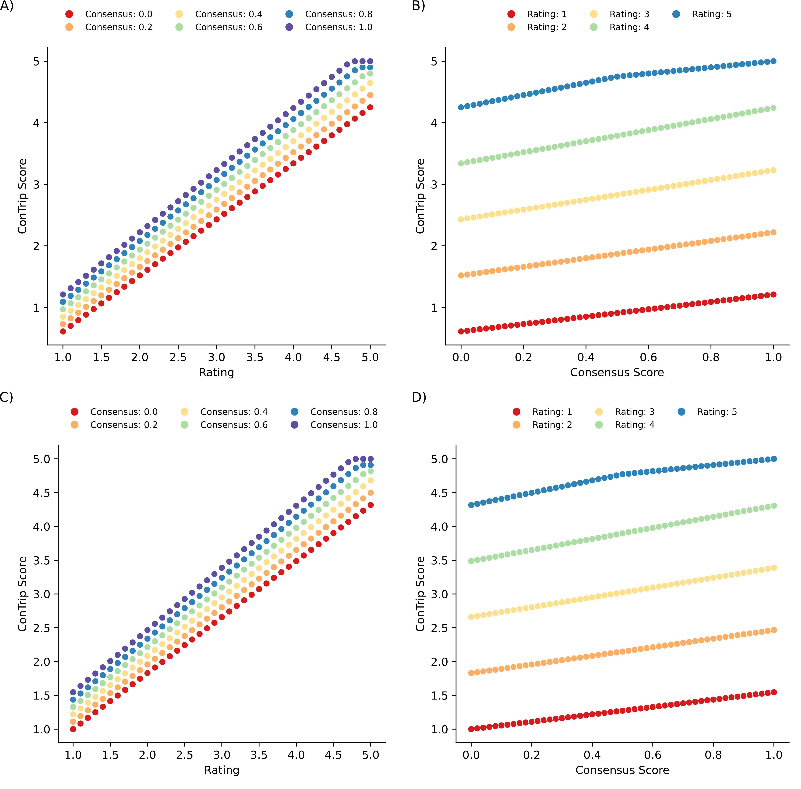

# ContripScore
ContripScore is essentially a score that combines an Internet platform rating and a consensus rating from sentiment analysis (For instance, by Nguyen et al. 2020). This novel scoring system has the advantage of bringing together both sources of information (sentiment analysis and overall rating) into a single score. Furthermore, as the consensus ranking of the sentiment analysis, our ContripScore allows differentiation of closely rated items while providing better interpretability. The increased interpretability arises from our ContripScore representing a value between 0 and 5 (without scaling. Figure below A and B) or 1 and 5 (with scaling. Figure C and D) . This range, related to any platform, could improve the ranking and the user's understanding of how good it is the experience they are buying. 

# Contents
- [Installation](#Installation)
- [Usage](#Usage)

# Installation
## Clone repository
First download the repository:

        git clone https://github.com/pepebonet/contripscore.git

## Install dependencies
We highly recommend to use a virtual environment to run the scripts: 

`Create environment and install contripscore:`

        conda create --name contripscore python=3.8
        conda activate contripscore
        pip install -r requirements.txt

# Usage

## Main

To compute the ContripScore of a given hotel, establishment or experience run the following command: 

    python scripts/main.py -tr 5.0 -cv 1.0 -w1 0.5 -w2 10 -o output_folder

### Commands

`-tr`: Tripadvisor rating 

`-cv`: Consensus value from NLP

`-w1`: Weight 1 for the score calculation

`-w2`: Weight 2 for the score calculation

## Reproduce Figures

To obtain the figure run the following commands (First without scaling and the second with it): 

    python scripts/comparison_figures.py
    python scripts/comparison_figures.py -sf
